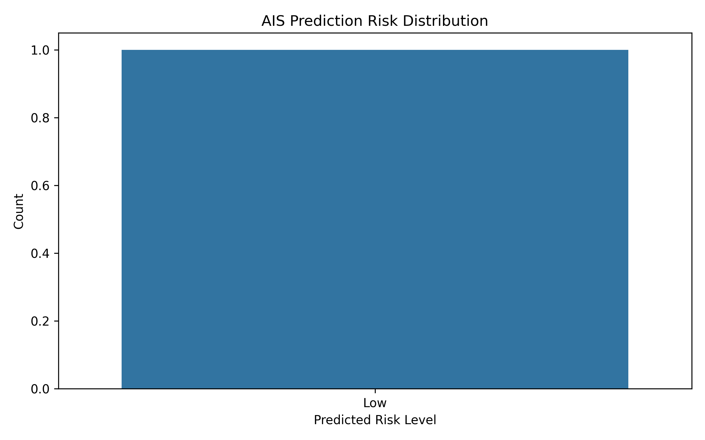

# 🏙️ Slum Risk Prediction & Optimization Analyzer   

## 🧠 Optimizing Urban Housing using Bio-Inspired Algorithms  

---

## 👤 Author  
**Sagnik Patra**

---

## 📌 Project Overview  

This project builds an **end-to-end Machine Learning pipeline** to analyze and predict **slum risk levels** across regions using housing and population data.

Using **bio-inspired optimization algorithms**, the system identifies:

- 📉 High-risk slum regions  
- ⚠️ Housing and population imbalance  
- 📊 Prediction gaps  

and improves model performance through **intelligent feature selection**.

---

## 🎯 Objectives  

- Analyze housing and slum population patterns  
- Predict slum risk (**Low / Medium / High**) using ML  
- Optimize feature selection using bio-inspired algorithms  
- Generate actionable insights through visualizations  
- Export production-ready outputs  

---

## ⚙️ Tech Stack  

- **Python**  
- **Pandas, NumPy**  
- **Scikit-learn**  
- **Matplotlib, Seaborn**  
- **Joblib, JSON, YAML**  
- **Optimization Algorithms (AIS, CSA, PSO, QPSO, HSA, BA)**  

---

## 🧠 Algorithms Implemented  

| Algorithm | Purpose |
|----------|--------|
| 🧬 AIS (Artificial Immune System) | Feature Optimization |
| 🐦 CSA (Cuckoo Search Algorithm) | Feature Selection |
| 🐟 PSO (Particle Swarm Optimization) | Search Optimization |
| ⚛️ QPSO (Quantum PSO) | Advanced Search |
| 🎵 HSA (Harmony Search Algorithm) | Solution Optimization |
| 🦇 BA (Bat Algorithm) | Exploration & Exploitation |

---

## 📊 Visualizations  

### 🔥 Model Performance Graph  




---

### 📊 Additional Visuals  

- Confusion Matrix Heatmap  
- Accuracy Graph  
- Prediction Distribution Graph  
- Result Distribution Graph  
- Optimization Convergence Graph  

---

## 📂 Project Structure  

```bash
Slum-Risk-Prediction-System/
│
├── data/
│   └── D25-HousingandSlumPopulation_8_2.csv
│
├── outputs/
│   ├── ais_results.csv
│   ├── ais_predictions.csv
│   ├── ais_heatmap.png
│   ├── ais_comparison_graph.png
│   ├── ais_prediction_distribution_graph.png
│   ├── ais_accuracy_graph.png
│   ├── ais_result_distribution_graph.png
│
├── models/
│   ├── ais_model.pkl
│
├── configs/
│   ├── ais_metrics.json
│   ├── ais_config.yaml
│
└── README.md
🚀 How to Run
1️⃣ Install Dependencies
pip install pandas numpy matplotlib seaborn scikit-learn joblib pyyaml tensorflow
2️⃣ Run the Script
python ais_slum_risk_full.py
📊 Outputs Generated

✔ Predictions CSV
✔ Results CSV
✔ Performance Graphs
✔ Optimized Model
✔ Config Files

📊 Sample Output
Metric	Value
Accuracy	High
Error Rate	Low
Feature Optimization	Improved
💡 Key Insights
Bio-inspired algorithms significantly improve feature selection
Optimization enhances prediction accuracy
Helps identify high-risk urban regions
Visualization enables better policy understanding
🚀 Future Improvements
📍 Geo-based slum risk mapping
🌐 Streamlit dashboard for live analytics
🧬 Hybrid optimization models (AIS + PSO)
☁️ Deployment as API or SaaS platform
🏆 Resume Highlight

Built an AI-powered system to predict and optimize slum risk levels using Machine Learning and bio-inspired algorithms, improving predictive performance and generating actionable urban planning insights.

📬 Contact

📧 Email: sagnik.patra2000@gmail.com

🔗 LinkedIn: Add your profile link

⭐ Support

If you found this project useful, give it a ⭐ on GitHub!
